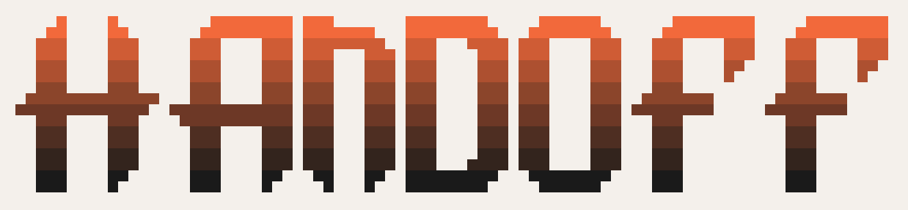

Goal-focused context transfer for Claude Code - transform `/compact` into system instructions that preserves the current task post-compact

## What It Does

Claude-Handoff extends `/compact` with optional goal-focused handoff. When you run `/compact handoff:<your goal>` the plugin:

1. Captures your goal and current session state before compaction
2. Analyzes the previous thread to extract an immediate handoff instructions
3. Injects the handoff as a system message in the new, compacted session
4. Automatically starts the new session ready to execute your goal

Simply prompt the agent to 'proceed' and you're away.

## How It Works

1. **PreCompact Hook**: Activates only when you use `/compact handoff:...` format
   - Extracts your goal from the `handoff:` prefix
   - Uses `claude --resume <session> --fork-session --model haiku --print <prompt>` to generate handoff immediately
   - Saves pre-generated handoff content and goal to `.git/handoff-pending/handoff-context.json` temporarily

2. **Compact**: Proceeds normally

3. **SessionStart Hook**: Runs in the continued session
   - Reads pre-generated handoff content from saved state
   - Injects handoff as system message
   - Cleans up state file

4. **Result**: Session continues with focused context injected, ready to execute your goal, just prompt it to go

## Why?

Traditional compaction is lossy and unfocused - each summary degrades context quality. Goal-focused handoffs produce sharper results and get you back where you left off.

## Trade-offs

Inspired by [AmpCode's handoff model](https://ampcode.com/news/handoff), and my own observations, this plugin auto-injects generated context without human review. Claude Code hooks can't pause for user editing.

PreCompact prompting for handoff adds some execution time to `/compact`, approximately ~20s.

## Installation

```bash
# From your project directory
claude plugin marketplace add kylesnowschwartz/claude-handoff
claude plugin install claude-handoff
```

## Usage

**Trigger goal-focused handoff:**
```bash
/compact handoff:now implement this for teams as well, not just individual users
/compact handoff:execute phase one of the created plan
/compact handoff:find other places in the codebase that need this same fix
```

**Regular compact (no handoff):**
```bash
/compact
/compact keep the context tight
```

## Configuration

Enable debug logging: Edit `handoff-plugin/hooks/lib/logging.sh` and set `LOGGING_ENABLED=true`

View logs:
```bash
tail -f /tmp/handoff-precompact.log /tmp/handoff-sessionstart.log
```

## Development

This plugin follows the Claude Code plugin architecture:
- `.claude-plugin/marketplace.json` - Local marketplace definition
- `handoff-plugin/.claude-plugin/plugin.json` - Plugin metadata
- `handoff-plugin/commands/` - Slash commands
- `handoff-plugin/hooks/` - Hook implementations

## License

MIT - See LICENSE file for details
